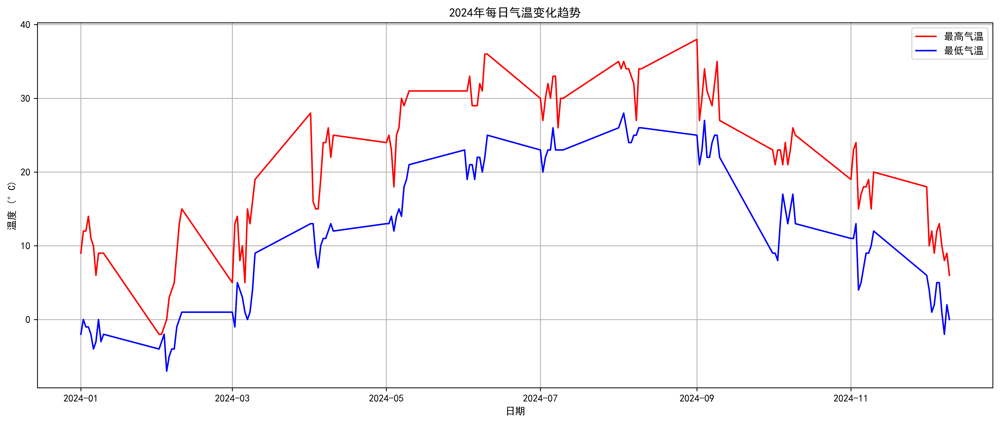
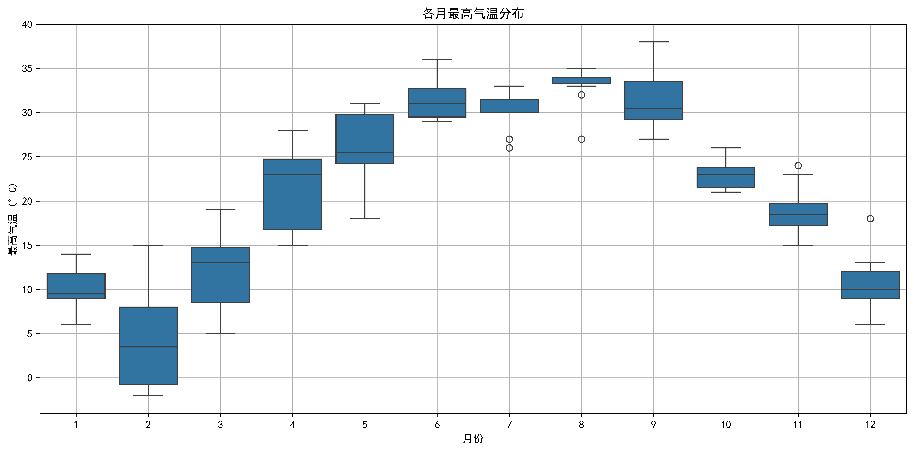
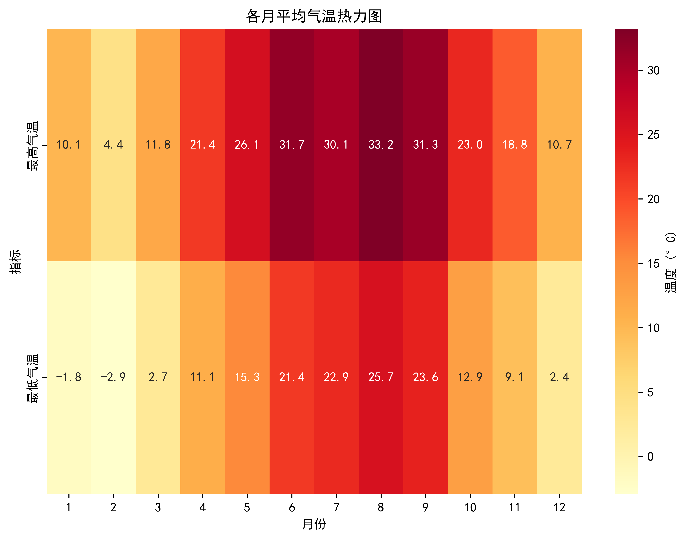
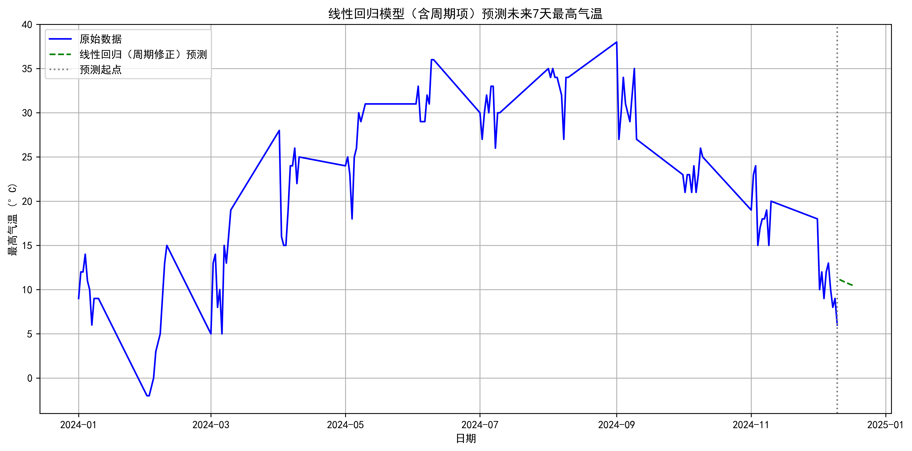

# 🌡️ 郑州市气温数据分析与预测

> 基于时间序列的天气数据分析 | Web爬取 + ARIMA预测


## 📊 项目概述

本项目对郑州市2024年全年气温数据进行收集、清洗、分析和预测。

### 数据来源
- **数据爬取**：从天气网站获取郑州市2024年1月-12月每日天气数据
- **时间跨度**：2024年1月1日 - 2024年12月31日
- **数据字段**：日期、最高气温、最低气温、天气状况、风向

### 分析目标
1. 探索气温的变化规律和季节性特征
2. 分析气温与风力等气象因素的关系
3. 使用时间序列模型预测未来气温走势

---

## 📁 项目结构

```
temperature-prediction/
├── README.md                    # 项目介绍
├── requirements.txt             # 依赖列表
├── data/
│   └── weather.csv             # 天气数据（原始）
├── notebooks/
│   └── 气温分析与预测.ipynb     # 完整分析 Notebook
├── figures/                     # 分析图表
│   ├── trend_plot.png          # 气温趋势图
│   ├── boxplot_monthly.png     # 月度箱线图
│   ├── heatmap_avgtemp.png     # 平均气温热力图
│   └── prediction_compare.png  # 预测对比图
└── src/
    ├── spider.py               # 数据爬虫
    ├── preprocessing.py        # 数据预处理
    └── models.py              # 预测模型
```

---

## 🔍 分析流程

### 1. 数据收集

```python
import requests
from lxml import etree

def get_weather(url):
    headers = {
        'User-Agent': 'Mozilla/5.0...'
    }
    resp = requests.get(url, headers=headers)
    resp_html = etree.HTML(resp.text)
    # xpath 提取数据...
```

**技术要点**：
- 使用 requests 库模拟浏览器请求
- 使用 xpath 解析 HTML 结构
- 遍历多个月份页面获取完整数据

### 2. 数据预处理

```python
# 处理温度字符串（如 "28℃" → 28）
df['最高气温'] = df['最高气温'].str.replace('℃', '').astype(int)
df['最低气温'] = df['最低气温'].str.replace('℃', '').astype(int)

# 转换日期格式
df['日期'] = pd.to_datetime(df['日期'])

# 计算平均气温
df['平均气温'] = (df['最高气温'] + df['最低气温']) / 2
```

### 3. 探索性数据分析 (EDA)

#### 3.1 气温趋势分析


#### 3.2 月度气温分布


#### 3.3 气温热力图


### 4. 时间序列预测

#### 4.1 线性回归模型

```python
from sklearn.linear_model import LinearRegression
from sklearn.metrics import mean_squared_error

# 添加周期特征
df['day_of_year'] = df['日期'].dt.dayofyear
X = df[['day_of_year', 'sin_day', 'cos_day']]
y = df['最高气温']

model_lr = LinearRegression()
model_lr.fit(X, y)
```

#### 4.2 ARIMA 模型

```python
from statsmodels.tsa.arima.model import ARIMA
from statsmodels.tsa.stattools import adfuller

# ADF 平稳性检验
adf_result = adfuller(data['最高气温'])
print(f'ADF Statistic: {adf_result[0]:.4f}')

# 拟合 ARIMA 模型
model_arima = ARIMA(data['最高气温'], order=(2, 1, 2))
result_arima = model_arima.fit()

# 预测未来7天
forecast = result_arima.forecast(steps=7)
```

### 5. 模型评估

| 模型 | RMSE | R² | 说明 |
|------|------|-----|------|
| 线性回归 | - | - | 考虑周期性 |
| ARIMA(2,1,2) | - | - | 时间序列专精 |

---

## 📈 分析结果

### 关键发现

1. **季节性明显**：夏季最高温可达38℃，冬季最低温-4℃
2. **周期性规律**：气温呈正弦曲线变化，周期为一年
3. **ARIMA适用**：差分后序列平稳，适合时间序列预测

### 预测效果


---

## 🔧 环境配置

```bash
# 1. 克隆项目
git clone https://github.com/YOUR_USERNAME/temperature-prediction.git
cd temperature-prediction

# 2. 创建虚拟环境
python -m venv venv
source venv/bin/activate  # Linux/Mac
# 或
venv\Scripts\activate  # Windows

# 3. 安装依赖
pip install -r requirements.txt

# 4. 运行 Notebook
jupyter notebook notebooks/基于时间序列的气温分析与预测.ipynb
```

### 依赖列表

```
pandas>=1.3.0
numpy>=1.21.0
matplotlib>=3.4.0
seaborn>=0.11.0
requests>=2.25.0
lxml>=4.6.0
statsmodels>=0.13.0
scikit-learn>=1.0.0
```

---

## 📚 学习心得

### 踩过的坑

1. **中文字体显示问题**
   ```python
   # 解决 matplotlib 中文显示
   plt.rcParams['font.sans-serif'] = ['SimHei']
   plt.rcParams['axes.unicode_minus'] = False
   ```

2. **温度字符串处理**
   ```python
   # 错误：直接转换
   df['最高气温'].astype(int)  # 会报错！
   
   # 正确：先去除单位
   df['最高气温'] = df['最高气温'].str.replace('℃', '').astype(int)
   ```

3. **ARIMA 参数选择**
   - 使用 ACF/PACF 图辅助确定 p, q 参数
   - 通过网格搜索找到最优 (p, d, q) 组合

---

## 🚀 后续优化方向

1. **加入更多特征**：湿度、降水量、气压等
2. **尝试 Prophet 模型**：Facebook 的时间序列预测库
3. **LSTM 预测**：使用深度学习捕捉更复杂的模式
4. **多城市对比**：分析不同城市的气温规律

---

## 📄 许可证

MIT License - 随意使用，但请注明来源

---

*Made with ❤️ for learning*
